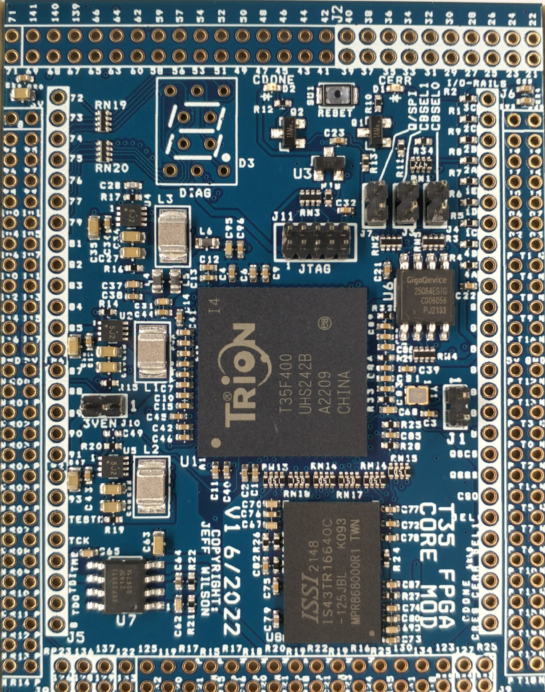
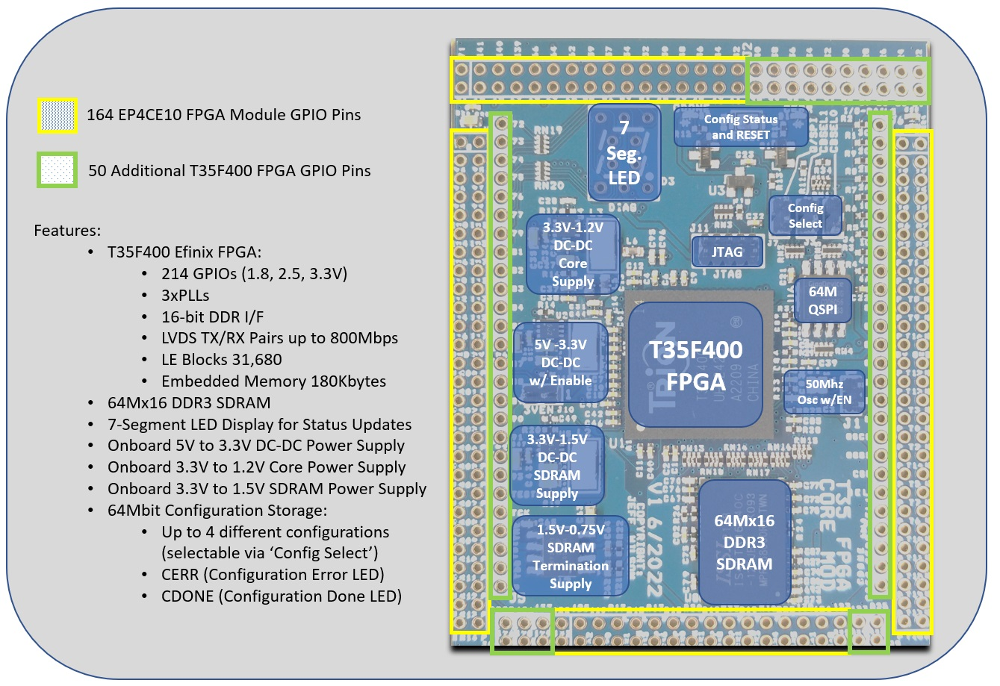
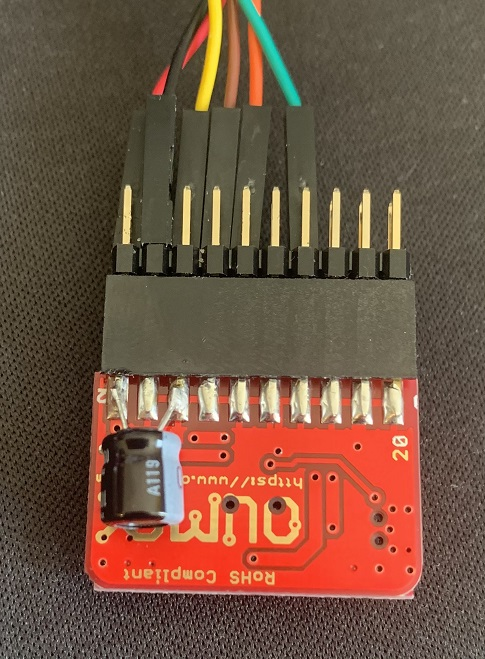
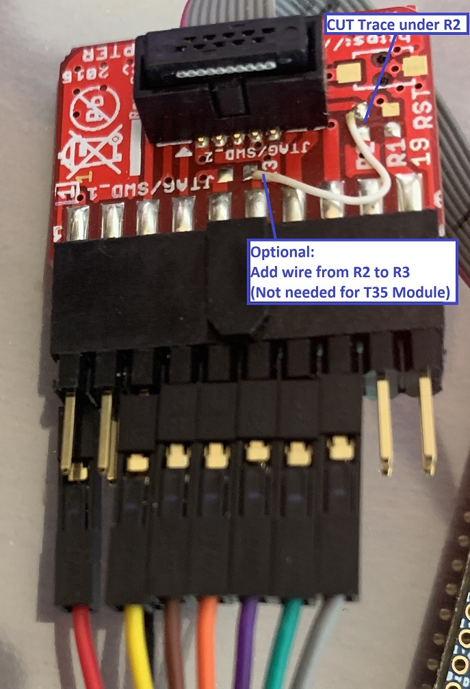

# T35_FPGA_MODULE
 S100Computers T35 FPGA Module Design

## Project Overview ##

This is a custom T35 FPGA project module for [S100Computers](http://s100computers.com/ "S100 Computers").  This module was designed to augment the EP4CE10 based FPGA originally in use on the various FPGA S-100 Boards in the S100Computers inventory.

The module pictured below is in the same basic footprint as the original, but with added pins (shown in white-filled rectanges surroundng the new pins).

Added features in comparison to the original EP4CE10 module include:
  - 50 Additional GPIO Pins for a total of 214 I/Os (Module is shipped with pins unmounted for added flexibility)
  - 3x the Logic Elements (31,680 vs 10,320)
  - 3.5x the Embedded FPGA RAM (180K vs 51K)
  - Adds in LVDS Capability (up to 800Mbps)
  - Adds 128MByte DDR3 SDRAM
  - Up to four configuration images (jumper selectable)
  - Seven Segment LED Display for custom status or diagnostic output

### T35 FPGA Module Image ###

### T35 FPGA Module Features Diagram ###

## Toolchain ##

The FPGA Tool-chain used for this project is the [EfinityIDE](https://efinixinc.com/products-efinity.html "Efinity IDE Toolchain") from [Efinix Inc](https://efinixinc.com/ "Efinix").

The Efinity IDE Toolchain is currently available with the purchase of an approved Efinity Development Board (see Efinix website for more details).

## Project Organization ##

Projects for this board are generally stored on the root of the host system hard drive in the \S100Projects\ directory (e.g. - C:\S100Projects\).  The user does not need to replicate this directory structure, but there may be some project specific links that will need to be adjusted to move a project to a different directory organization.

## JTAG Programming Adapters ##

The T35 FPGA Module uses a mini 5x2 JTAG Header with 0.05" (1.27mm) pin spacing.  Mating cables and a JTAG Adapter PCB are available from Olimex that can be adapted for use in programming the T35 FPGA Module.  The parts needed to implement this JTAG Programmer are available from [Digikey](https://www.digikey.com) and [Mouser](https://www.mouser.com):

    | Digikey Part No | Description         | Manf    | Manf Part No   |
    |-----------------|---------------------|---------|----------------|
    | 1188-1016-ND    | JTAG Adapter        | Olimex  | ARM-JTAG-20-10 |
    | 769-1106        | USB Adapter         | FTDI    | C232HM-DDHSL-0 |
    | S2021EC-10-ND   | Male to Male Header | Sullins | PRPC010DABN-RC |

    | Mouser Part No     | Description         | Manf     | Manf Part No   |
    |--------------------|---------------------|----------|----------------|
    | 909-ARM-JTAG-20-10 | JTAG Adapter        | Olimex   | ARM-JTAG-20-10 |
    | 895-C232HM-DDHSL-0 | USB Adapter         | FTDI     | C232HM-DDHSL-0 |
    | 649-77313-198-20LF | Male to Male Header | Amphenol | 77313-198-20LF |

The Olimex JTAG Adapter will need to be modified to fix a supply noise issue on the FTDI USB Adapter (where up to 700mV of noise is present on the FTDI 3.3V supply pin), and also to allow for use of the Olimex JTAG Adapter with the T35 JTAG pinout.

### Supply Noise Fix ###

To fix the supply noise issue, a 100uF electrolytic cap must be added between pins 2 and 4 or 6 on the 20-pin female header:

### Olimex JTAG Adapter Wire Mods ###

R2 on the Olimex JTAG Adapter (which is actually implemented as a trace/short) needs to be removed to avoid interfering with the Chip Select signal  of the configuration flash on the T35 FPGA Module (pin 9 on the 10-pin Olimex header).  See [OlimexJTAGschematic](https://www.olimex.com/Products/ARM/JTAG/ARM-JTAG-20-10/resources/ARM-JTAG-20-10_latest-schematic.pdf "Olimex JTAG Adapter") Schematic.

### FTDI USB Adapter to Olimex JTAG Header Connections ###

To connect the USB Adapter to the Olimex JTAG, first plug in the 20-pin male to male header into the Olimex Female 20-pin header.  Next plug the USB Adapter pin header cables into the following pins.  When done you should have a color sequence of wires as shown above.

    | JTAG Adapter Pin No | Color  | Signal Name     | T35 JTAG Pin No |
    |---------------------|--------|-----------------|-----------------|
    | Pin 2               | RED    | +3.3V Supply    | Pin 1           |
    | Pin 5               | YELLOW | JTAG TDI        | Pin 8           |
    | Pin 6               | BLACK  | GROUND          | Pins 3 and 5    |
    | Pin 7               | BROWN  | JTAG TMS        | Pin 2           |
    | Pin 9               | ORANGE | JTAG TCK        | Pin 4           |
    | Pin 11 (Optional)   | PURPLE | QSPI_CSN        | Pin 9           |
    | Pin 13              | GREEN  | JTAG TDO        | Pin 6           |
    | Pin 15              | GREY   | CRESET          | Pin 10          |

