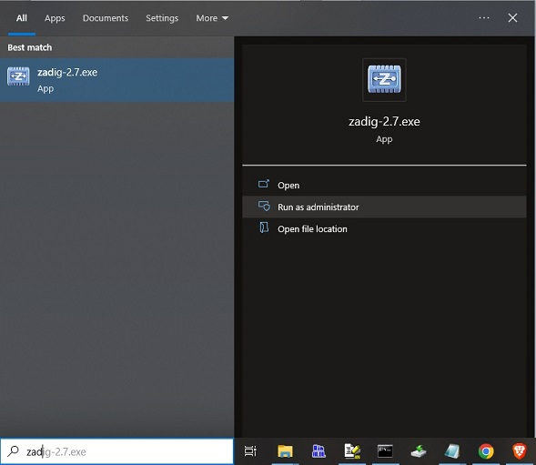
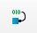

# T35_FPGA_MODULE
<b>[S100Computers](http://s100computers.com/ "S100Computers") T35 FPGA Module Design</b>

<b>Table of Contents:</b>
- [Project Overview](#protject-overview)
  - [T35 FPGA Module Image](#t35-fpga-module-image)
  - [T35 FPGA Module Features DIagram](#t35-fpga-module-features-diagram)
- [Toolchain](#toolchain)
- [Project Organization](#project-organization)
- [JTAG Programming Adapters](#jtag-programming-adapters)
  - [USB Adapter Supply Noise Fix](#usb-adapter-supply-noise-fix)
  - [Olimex JTAG Adapter Wire Mods](#olimex-jtag-adapter-wire-mods)
  - [FTDI USB Adapter to Olimex JTAG Header Connections](#ftdi-usb-adapter-to-olimex-jtag-header-connections)
- [Installing the FTDI/Zadig USB Drivers](#installing-the-ftdi/zadig-usb-drivers)
  - [Installing the Linux USB Driver](#installing-the-linux-usb-driver)
  - [Installing the Windows USB Driver](#installing-the-windows-usb-driver)

## Project Overview ##

This is a custom T35 FPGA project module for [S100Computers](http://s100computers.com/ "S100 Computers").  This module was designed to augment the EP4CE10 based FPGA originally in use on the various FPGA S-100 Boards in the S100Computers inventory.

The module pictured below is in the same basic footprint as the original, but with added pins (shown in white-filled rectanges surroundng the new pins).

Added features in comparison to the original EP4CE10 module include:
  - 50 Additional GPIO Pins for a total of 214 I/Os (Module is shipped with pins unmounted for added flexibility)
  - 3x the Logic Elements (31,680 vs 10,320)
  - 3.5x the Embedded FPGA RAM (180K vs 51K)
  - Adds in LVDS Capability (up to 800Mbps)
  - Adds 128MByte DDR3 SDRAM
  - Up to four configuration images (jumper selectable)
  - Seven Segment LED Display for custom status or diagnostic output

### T35 FPGA Module Image ###


### T35 FPGA Module Features Diagram ###


## Toolchain ##

The FPGA Tool-chain used for this project is the [EfinityIDE](https://efinixinc.com/products-efinity.html "Efinity IDE Toolchain") from [Efinix Inc](https://efinixinc.com/ "Efinix").

The Efinity IDE Toolchain is currently available with the purchase of an approved Efinity Development Board (see Efinix website for more details).

## Project Organization ##

Projects for this board are generally stored on the root of the host system hard drive in the \S100Projects\ directory (e.g. - C:\S100Projects\).  The user does not need to replicate this directory structure, but there may be some project specific links that will need to be adjusted to move a project to a different directory organization.

## JTAG Programming Adapters ##

The T35 FPGA Module uses a mini 5x2 JTAG Header with 0.05" (1.27mm) pin spacing.  Mating cables and a JTAG Adapter PCB are available from Olimex that can be adapted for use in programming the T35 FPGA Module.  The parts needed to implement this JTAG Programmer are available from [Digikey](https://www.digikey.com) and [Mouser](https://www.mouser.com):

    | Digikey Part No | Description         | Manf    | Manf Part No   |
    |-----------------|---------------------|---------|----------------|
    | 1188-1016-ND    | JTAG Adapter        | Olimex  | ARM-JTAG-20-10 |
    | 769-1106        | USB Adapter         | FTDI    | C232HM-DDHSL-0 |
    | S2021EC-10-ND   | Male to Male Header | Sullins | PRPC010DABN-RC |


    | Mouser Part No     | Description         | Manf     | Manf Part No   |
    |--------------------|---------------------|----------|----------------|
    | 909-ARM-JTAG-20-10 | JTAG Adapter        | Olimex   | ARM-JTAG-20-10 |
    | 895-C232HM-DDHSL-0 | USB Adapter         | FTDI     | C232HM-DDHSL-0 |
    | 649-77313-198-20LF | Male to Male Header | Amphenol | 77313-198-20LF |

### USB Adapter Supply Noise Fix ###

The Olimex JTAG Adapter will need to be modified to fix a supply noise issue on the FTDI USB Adapter (where up to 700mV of noise is present on the FTDI 3.3V supply pin), and also to allow for the use of the Olimex JTAG Adapter with the T35 JTAG pinout.

To fix the supply noise issue, a 100uF electrolytic cap must be added between pins 2 and 6 on the 20-pin female header:


### Olimex JTAG Adapter Wire Mods ###

R2 on the Olimex JTAG Adapter (which is actually implemented as a trace/short) needs to be removed to avoid interfering with the Chip Select signal  of the configuration flash on the T35 FPGA Module (pin 9 on the 10-pin Olimex header).  See [OlimexJTAGschematic](https://www.olimex.com/Products/ARM/JTAG/ARM-JTAG-20-10/resources/ARM-JTAG-20-10_latest-schematic.pdf "Olimex JTAG Adapter") Schematic.


### FTDI USB Adapter to Olimex JTAG Header Connections ###

To connect the USB Adapter to the Olimex JTAG, first plug in the 20-pin male to male header into the Olimex Female 20-pin header.  Next plug the USB Adapter pin header cables into the following pins.  When done you should have a color sequence of wires as shown above.

    | JTAG Adapter Pin No | Color  | Signal Name     | T35 JTAG Pin No |
    |---------------------|--------|-----------------|-----------------|
    | Pin 2               | RED    | +3.3V Supply    | Pin 1           |
    | Pin 5               | YELLOW | JTAG TDI        | Pin 8           |
    | Pin 6               | BLACK  | GROUND          | Pins 3 and 5    |
    | Pin 7               | BROWN  | JTAG TMS        | Pin 2           |
    | Pin 9               | ORANGE | JTAG TCK        | Pin 4           |
    | Pin 11 (Optional)   | PURPLE | QSPI_CSN        | Pin 9           |
    | Pin 13              | GREEN  | JTAG TDO        | Pin 6           |
    | Pin 15              | GREY   | CRESET          | Pin 10          |

## Installing the FTDI/Zadig USB Drivers

### Installing the Linux USB Driver:

(from Efinix AN006)
The following instructions explain how to install a USB driver for Linux operating systems.
  1. Disconnect your board from your computer.
  2. In a terminal, use these commands:
```
    > sudo <installation directory>/bin/install_usb_driver.sh
    > sudo udevadm control --reload-rules
```
<b>Note:</b> If your board was connected to your computer before you executed these commands, you need to disconnect and re-connect it.

### Installing the Windows USB Driver
  1. Download <b>Zadig</b> from [zadig.akeo.ie](https://zadig.akeo.ie/ "zadug.akeo.ie")
  2. Copy the <b>Zadig</b> application from the 'Downloads' to a working directory.
  3. Right click the <b>Zadig</b> application and select "Run as Administrator".



  4. Choose <b>Options->List All Devices</b> and turn off <b>Options->Ignore Hubs or Composite Parents</b>.


  5. Select <b>C232HM-DDHSL-0</b> from the drop down list.


  6. Select <b>libusbK</b> from the drop down list.


  7. Click <b>Reinstall Driver</b> or <b>Replace Driver</b>.

Proceed to the <b>Quick Start</b> section below to verify correct operation of the JTAG Programmer.
  
# Quick Start (after toolset and driver install)

## Quick Start Prep

  1. Download (Clone) the [T35seg7 Test Project](https://github.com/s100projects/T35seg7 "T35seg7 Test Project") to the <i>C:/S100Projects</i> directory.
  This is a good initial project to use on existing S100COmputers S-100 FPGA Boards as it does not drive any of the legacy WaveShare GPIOs; it only drives the GPIOs associated with the seven segment display (GPIOL_72 to GPIOL_81).  This avoids any signal conflicts with exisiting designs.
  The purpose of this FPGA project is to count from 0 to 'F' (hexadecimal) on one second boundaries.
  
  2. Start the Efinity toolchain and load the <i>C:/S100Projects/T35seg7.xml</i> project.
  3. Compile the T35seg7 project by clicking on the  icon. (Wait for completion)
  4. Connect the JTAG Adapter to the T35 JTAG port and plug the cable into a USB port.
  Be careful to align the red stripe of the JTAG cable to the left.  When done the JTAG cable should hang straight down to the Olimex JTAG Adapter without looping (if looped, you may have the cable ends reversed).
  
 
 
  5. Open the Efinity Programmer by clicking on the  icon.

  There are two types of programming that can be done with the T35 FPGA Module:
  - JTAG Programming (this targets the FPGA configuration RAM directly, but does not save it in Flash).
  - SPI Flash Programming (this targets the SPI Configuration Flash for confiuration auto-load on power on).
    
## JTAG Programming

  1. Click the "File Select" Button and select the <i>T35seg7.bit</i> configuration bitstream from the open file dialog box.
  2. Under "Programming Mode" select "JTAG" from the drop-down menu.
  3. Click the "Program Button"  to program the T35 via JTAG.


